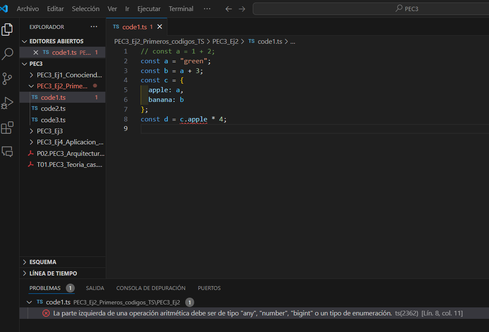
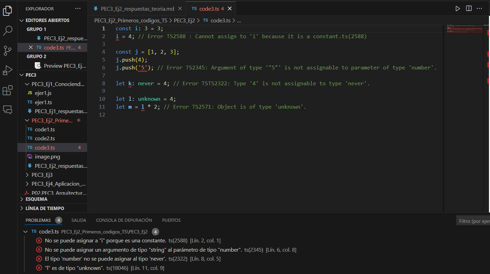

# Respuesta apartados ejercicio 2


**Explicación del error**

En este ejercicio, modificamos el código para provocar un TypeError. Cambiamos el valor de a de un número a un texto (string), asignándole "green". Al intentar realizar una multiplicación con este valor no numérico en const d = c.apple * 4;, TypeScript detecta el problema y muestra un error en el IDE:

###### "La parte izquierda de una operación aritmética debe ser de tipo any, number, bigint o un tipo de enumeración."

Este error surge porque TypeScript espera que c.apple sea un number, pero en este caso es un string. TypeScript advierte del error antes de ejecutar el código, asegurando que las operaciones solo se realicen con tipos compatibles.

1. **Para cada uno de los valores del fichero code2.ts, ¿Qué tipo de datos inferirá TypeScript? Explica por qué se ha inferido este tipo de datos**
``` typescript 
const a = 1042; //tipo number
const b = 'apples and oranges'; //tipo string
const c = 'pineapples'; //tipo string
const d = [true, true, false]; // tipo boolean[]
const e = { type: 'ficus' }; // tipo { type: string } 
const f = [1, false]; // tipo (number | boolean)[]
const g = [3]; // tipo number[]
const h = null; // tipo null
```

2. **¿Por qué se dispara cada uno de los errores del fichero code3.ts?**

``` typescript
const i: 3 = 3;
i = 4; // Error TS2588 : Cannot assign to 'i' because it is a constant.ts(2588)
//Este error salta porque `i` es una constante, y no se puede reasignar un nuevo valor a una constante después de su declaración. Si quisiéramos cambiar el valor, deberíamos usar `let` en lugar de `const`.

const j = [1, 2, 3];
j.push(4);
j.push('5'); // Error TS2345: Argument of type '"5"' is not assignable to parameter of type 'number'.
// Este error salta porque TypeScript infiere que `j` es un array de números (`number[]`), y al intentar agregar un valor de tipo string ('5'), el tipo no coincide. Para solucionarlo, tendríamos que asegurar que solo se agreguen números, eliminando las comillas.


let k: never = 4; // Error TSTS2322: Type '4' is not assignable to type 'never'.
// Este error ocurre porque `never` es un tipo que no puede tener ningún valor asignado. Al intentar asignar `4`, que es un número, TypeScript lanza un error porque `never` no acepta ningún valor.


let l: unknown = 4;
let m = l * 2; // Error TS2571: Object is of type 'unknown'.
//Como no sabemos qué valor tiene l porque es unknown, tendríamos primero que verificar que sea un número para poder multiplicarlo después. 
```

3. **¿Cuál es la diferencia entre una clase y una interface en TypeScript?**

En TypeScript, tenemos una forma más estricta y controlada de trabajar con clases e interfaces. Ambas nos ayudan a organizar y estructurar el código, pero tienen propósitos diferentes.

- **Clases en TypeScript:**
  
  Una clase en TypeScript es como una plantilla para crear objetos. Define qué propiedades tendrán esos objetos, qué métodos pueden usar y cómo se inicializan. Las clases también permiten controlar el acceso a las propiedades y métodos mediante los modificadores de acceso, como public, private y protected.
  - public: Propiedades y métodos accesibles desde cualquier lugar.
  - private: Solo accesibles dentro de la clase.
  - protected: Accesibles dentro de la clase y sus subclases.

**Interfaces en TypeScript:**
Las interfaces definen la forma de los objetos y especifican qué propiedades y métodos debe tener un objeto. Promueven la coherencia y la reutilización del código.
Nos aseguran que todos los objetos que las implementen sigan una estructura común, dejando la implementación de los detalles a cada clase.

Las interfaces son útiles cuando quieres asegurarte de que varios objetos tengan la misma estructura sin especificar cómo deben hacerlo.